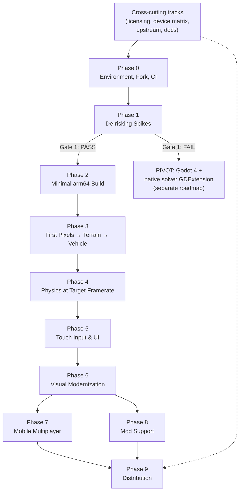

# Roadmap — Rigs of Rods Android Port

> Dependency-ordered, gate-driven roadmap. **No timelines by design** — phases complete when their exit criteria are met, not when a date arrives. Order matters; dates don't.
>
> Companion documents: [Project Plan.md](Project%20Plan.md) (research & rationale), [AGENTS.md](AGENTS.md) (rules for AI assistants), [DECISIONS.md](DECISIONS.md) (locked & open decisions), [RISKS.md](RISKS.md) (risk register & pivot triggers), [GLOSSARY.md](GLOSSARY.md).

---

## How to read this roadmap

- **Phases are dependency-ordered.** Each phase lists its prerequisites. Do not start a phase whose prerequisites are unmet — the ordering *is* the risk management.
- **Gates are decision points, not formalities.** A gate with a pivot option (notably Gate 1) can redirect the entire project. Treat gate evidence honestly.
- **Tasks are checkboxes** so this file doubles as a living tracker. Check items off, add discovered work under the relevant workstream, and never delete completed items (they're the project log).
- **Every phase tags work as `[AI]` (AI-assistable) or `[HUMAN]` (human-critical).** `[HUMAN]` items — GPU driver triage, numerical stability, threading bugs, netcode/NAT — are where schedule risk concentrates for a solo developer. Plan energy accordingly.

## Phase dependency graph

Notes on the graph:
- Phases 7 (multiplayer) and 8 (mods) both depend on Phase 6 but not on each other; they can interleave, though multiplayer deliberately comes **late** (it depends on stable physics, actor lifecycle, and finalized content formats).
- The cross-cutting tracks (bottom of this file) run continuously through every phase.

## Guiding principles (apply to every phase)

1. **De-risk before committing.** The two Phase 1 spikes exist to fail fast. Do not skip them or soften their exit criteria.
2. **The node/beam solver is the crown jewel.** Keep it isolated behind a clean C-style API from day one — it is the one asset that survives *any* strategy pivot (OGRE, ogre-next, or Godot).
3. **Adopt AGDK, don't hand-roll Android plumbing.** GameActivity, Swappy, ADPF, Oboe, Game Controller library, Memory Advice API, Play Asset Delivery.
4. **Own the stack; mine upstream as reference (D-012).** The fork owns the OGRE 1.11→14.x upgrade, Cg removal, and dependency modernization outright — nothing is blocked on upstream landing anything. Upstream's public GPLv3 work (notably PR #3418) is read and borrowed from freely, but the fork neither depends on it nor commits to contributing back. Still structure code so upstreaming stays *possible*: it costs nothing and preserves the option.
5. **arm64-v8a + Vulkan only.** No armeabi-v7a, no GLES render path, no x86 except an optional x86_64 emulator build for dev convenience. Fallback strategy is feature-scaling *within* Vulkan plus a device allow/deny list — not a second render path.
6. **License-clean or it doesn't ship.** GPLv3 code compliance, no community mod content without per-creator permission, distinct name and branding (trademark), no Apple App Store.
7. **Design for sustained performance, not peak.** Midrange baseline: 1080p-class render resolution, locked 30 fps. Flagship: native-res 60 fps for moderate scenes. Tune for post-throttle clocks.

---

## Phase 0 — Environment, Fork, CI

**Goal:** A renamed fork that still builds and runs on desktop, a working Android toolchain, CI that protects the desktop build, and verified knowledge of upstream's OGRE 14 status.

**Prerequisites:** none.

### 0.1 Upstream status verification (do this first)

The entire plan assumes the OGRE 1.9→14 upgrade and Cg removal are *incomplete* upstream. That was true as of the research; verify before doing anything else — if it has landed, Phase 1–3 risk drops substantially and the task list changes.

- [x] `[AI]` Check `RigsOfRods/rigs-of-rods` master: current OGRE version in the dependency stack, status of issue #1412 (Remove nvidia-cg-toolkit), and any OGRE-14 branch/PR activity. *(2026-07-31: master pins OGRE 1.11.6.1; #1412 closed 2018 — Cg toolkit out of build deps, but Cg shader content still in use; dormant `ogre-13`/`ogre-14` branches exist. See DECISIONS.md V-1.)*
- [x] `[AI]` Check the state of RoR's forks of Caelum, PagedGeometry, MyGUI — which OGRE versions they currently compile against. *(2026-07-31: all Conan-pinned against OGRE 1.11.6.1; `ogre-caelum` stale since 2020 and slated for replacement by SkyX upstream. See DECISIONS.md V-4.)*
- [x] `[AI]` Survey open PRs/issues for in-flight render-path work worth building on instead of duplicating. *(2026-07-31: **PR #3418 — minimal OGRE 14.5 upgrade — active as of Jul 25 2026**; PR #3380 — SkyX replacing Caelum to ditch Cg; PR #3431 — SDL input exploration.)*
- [ ] `[HUMAN]` Review findings in [DECISIONS.md](DECISIONS.md) (V-1, V-4) and sign off on the Phase 1–3 adjustments below.

### 0.2 Fork identity & license hygiene

- [x] `[HUMAN]` Choose a distinct project name and working title. *(**Trussline** — D-011. GitHub org name free, no trademark conflicts in software/game classes.)*
- [x] `[AI]` Clone upstream history locally. *(`trussline/` — full history at upstream HEAD `7e38912d2`, 2026-07-24, 397 MB. `origin` renamed to `upstream`; strategy is a fresh repo with upstream as a remote, not a GitHub fork.)*
- [x] `[AI/HUMAN]` **Create the `YDTHobby/trussline` remote and push.** *(Repo created public at https://github.com/YDTHobby/trussline; `origin` added, Phase 0 commit `e93a5e628` pushed with full upstream history.)*
- [x] `[AI]` Retain `LICENSE` (GPLv3) unchanged; add a `NOTICE`/attribution section crediting the upstream project prominently. *(Commit `e0689c5e9`. `NOTICE` covers attribution, the non-affiliation statement, the trademark position, GPLv3 obligations, LGPL components to track, the Cg redistribution prohibition, and the content boundary.)*
- [ ] `[AI]` Audit and replace **in-source** branding strings/assets. *(Inventory completed 2026-07-31; edits deliberately deferred until the desktop reference build is green — rebranding mid-bring-up would muddy the very baseline § 2.0 measures against.)*

  **⚠️ Do NOT bulk-replace.** A naive search-and-replace across the 1,667 hits in 326 files would strip the **GPL license headers** — every source file carries a 5-line "This file is part of Rigs of Rods / is free software…" notice. GPLv3 §5 requires preserving those. **License headers stay untouched.** Only the ~32 genuine user-visible strings below change:

  - [ ] **Packaging** — `source/main/CMakeLists.txt:559-573` (CPack name, description, summary, executables, desktop links).
  - [ ] **App identity** — `AppContext.cpp:378,550` · `utils/Utils.cpp:87,95` · `icon.rc:72,77` (FileDescription, ProductName).
  - [ ] **User data directory** ⚠️ *functional, not cosmetic* — `AppContext.cpp:524,622,640` and `physics/collision/Collisions.cpp:199` hardcode `My Documents/Rigs of Rods`. Changing it relocates config and mods. Moot on Android (app-specific storage), but it must be decided rather than drifted into.
  - [ ] **Console + UI text** — `system/ConsoleCmd.cpp:228,236,388` · `gui/panels/GUI_GameAbout.cpp:47,115` · `GUI_MultiplayerSelector.cpp:145` · `system/AppConfig.cpp:439`.
  - [ ] **HTTP User-Agent** ⚠️ *honesty issue* — `network/CurlHelpers.cpp:74` and `GUI_RepositorySelector.cpp:179,266,410` send `"Rigs of Rods Client"`. A different product must not identify itself as theirs when calling their servers. **Change before any networked build runs.**
  - [ ] **Exported file headers** — `RigDef_Serializer.cpp:55` stamps `; Project: Rigs of Rods (http://www.rigsofrods.org)` into every truck file we write.
  - [ ] **Desktop-only integrations** — `audio/MumbleIntegration.cpp:128-129` and `network/DiscordRpc.cpp:84`. Both compile out on Android; Discord RPC is slated for removal anyway (LEGAL.md A2).
  - [ ] **Image assets** — `doc/images/RoR_Banner.png` and the icon set.

- [x] `[AI]` **Stop calling upstream infrastructure.** ✅ **Done 2026-07-31.** Investigation found **three** live endpoints, not the one originally flagged:
  - `remote_query_url` → `https://v2.api.rigsofrods.org` (mod repository)
  - `mp_api_url` → `http://api.rigsofrods.org` (serverlist) — **worse than the repository and previously unflagged**: we replace the RoRnet transport outright (D-007), so we aren't protocol-compatible with those servers. Listing them would mislead users as well as burden upstream.
  - A **hardcoded** `forum.rigsofrods.org` download host in `DownloadResourceFile`.

  Both CVars now default to empty and stay `CVAR_ARCHIVE`, so the features are **gated, not deleted** — point either at a host and it works. All five network paths guard on it and report "not configured" rather than emitting a malformed request and blaming the user's connection. User-Agent changed from `"Rigs of Rods Client"` to `"Trussline Client"` at all four sites.

  ⚠️ **Known gap, commented in code:** the download host is hardcoded and *not* derived from `remote_query_url`, so re-pointing that CVar would still pull files from upstream. The gate is what keeps us off their servers until Phase 8 makes the host configurable.
- [x] `[AI]` **Resolve the CI overlap.** *(Commit `c5751b1b7`. The hand-written `desktop-build.yml` had a placeholder Conan URL and a guessed apt list — it could never have gone green — so it was replaced wholesale by an adaptation of upstream's proven `build-game.yml`, and `build-game.yml` deleted as superseded. `linux-native.yml` was **kept** but switched to manual trigger: it builds every dependency from source with explicit CMake flags, making it the desktop reference for `android/superbuild`. Its OGRE flags independently confirmed `OGRE_RESOURCEMANAGER_STRICT=0`.)*
- [x] `[AI]` Replace upstream's `README.md` with a Trussline one. *(Commit `e0689c5e9`. Upstream badges, banner, sponsors, and community links removed — they point at the upstream project and would imply affiliation. Copyright lines preserved and extended.)*
- [x] `[AI]` Import the document set into the repo root. *(`ROADMAP.md`, `AGENTS.md`, `DECISIONS.md`, `RISKS.md`, `GLOSSARY.md`, `PROJECT-PLAN.md`, `BUILDING-ANDROID.md`, plus `android/superbuild/CMakeLists.txt` and `android/solver-api-sketch.h`.)*

### 0.3 Development environment

- [x] `[HUMAN]` Install Android Studio, Android SDK, NDK, CMake, JDK. *(Audited 2026-07-31 — Studio, SDK, CMake 3.29.2, Ninja, git, Python, ADB all present. **NDK `27.3.13750724` installed and pinned (D-014)**; Conan 2.31.1 installed.)*
- [x] `[HUMAN]` **Install JDK 17.** *(Temurin 17.0.20 installed; `JAVA_HOME` corrected from the stale JRE 8 to the JDK. `ANDROID_HOME` and `ANDROID_NDK_HOME` also set — D-014.)*
- [x] `[HUMAN]` **Install Visual Studio Build Tools (C++ workload).** *(VS Build Tools 2022 v17.14 verified to carry the VC++ toolset. Use it, not the 2019 install also present; VS Community 2026 lacks VC++ entirely.)*
- [x] `[AI]` Set up the desktop build environment and confirm a clean desktop build. ✅ **GREEN (2026-07-31).** MSVC 2022 v14.44 + Ninja + Conan 2.31.1. Conan built the dependency graph from source (OGRE 1.11.6.1, MyGUI, OIS, SocketW, zziplib, libtiff, libcurl, FreeImage, jasper, discord-rpc); CMake configured in 434 s finding all required packages; 362/362 objects compiled with **zero errors**; `ninja install` produced `redist/RoR.exe` (13.1 MB) plus resources, languages, and the three content archives. **This is now the reference behavior § 2.0 measures the OGRE upgrade against.**
- [ ] `[AI]` Minor cleanups surfaced by the reference build: upstream's CI passes `-DCREATE_CONTENT_FOLDER=ON` but the option was renamed **`ROR_CREATE_CONTENT_FOLDER`**, so that flag has been a silent no-op (fixed in our workflow; it defaults ON, hence no visible breakage). The install also drops an `.itch.toml` we have no use for.
- [x] `[HUMAN]` Assemble the physical device pool. *(One mid-to-low range device in hand — becomes the entry-tier reference, D-013. Adding a flagship later would widen coverage but is not blocking.)*
- [ ] 🔴 `[HUMAN]` **BLOCKER — restore ADB connectivity.** `adb devices` reports nothing and Windows shows no Android USB device (checked 2026-07-31; ADB itself is fine at `C:\platform-tools\adb.exe`). Until this is fixed there is no device identification, no on-device testing, and no valid Gate 1 evidence. Troubleshooting sequence in `fork-scaffold/BUILDING-ANDROID.md` § 5 — most likely causes, cheapest first: USB mode set to charging-only, USB debugging not enabled, unaccepted RSA prompt, charge-only cable, missing OEM driver.
- [ ] `[AI]` Once connected: capture SoC, GPU family, Android version, Vulkan driver version, core topology, and RAM into the device matrix (D-013 leaves the model TBD).
- [x] `[AI]` Document environment setup end-to-end in the fork (`BUILDING-ANDROID.md` skeleton) so it is reproducible. *(Written to `fork-scaffold/BUILDING-ANDROID.md`, including the ADB troubleshooting sequence above.)*

### 0.4 Continuous integration

- [x] `[AI]` Stand up CI (GitHub Actions): desktop build job on every push — the desktop build must never silently break while Android work proceeds. *(Live at [YDTHobby/trussline](https://github.com/YDTHobby/trussline/actions); all three workflows registered and active. **Note:** pushes did not auto-trigger runs on this fresh repo, which is why `workflow_dispatch` was added to both active workflows — first run was dispatched manually. Watch whether subsequent pushes trigger normally.)*
- [ ] `[AI]` Add code formatting/lint checks consistent with upstream style.
- [ ] `[AI]` Prepare (but don't require yet) an Android cross-compile job skeleton; it becomes mandatory in Phase 2. *(Written: `fork-scaffold/.github/workflows/android-build.yml`, non-blocking until Phase 2.4.)*
- [ ] `[AI]` Set up build caching (Conan cache / ccache) to keep CI turnaround tolerable. *(Conan cache keyed on `conanfile.py`, superbuild cache keyed on `android/superbuild/**` — both in the scaffolded workflows.)*

**Exit criteria:**
- [x] **Fork builds for desktop, green.** ✅ Locally on Windows/MSVC 2022 (362/362 objects, `RoR.exe` 13.1 MB) **and** in CI — the **Linux job passed all 12 steps in 4.4 min** with the artifact uploaded (run `30668215843`). Fast because Conan serves prebuilt Linux binaries from the nexus remote, where Windows must build from source. ⚠️ *The Windows CI job is still unverified* — it was cancelled by supersession on every attempt while long builds ran. The local Windows build covers the same ground more directly, so this is a gap in CI evidence, not in the build itself.
- [x] **Android toolchain installed and documented.** NDK 27.3.13750724, JDK 17, Conan 2.31.1, VS 2022 Build Tools; `BUILDING-ANDROID.md` written (D-014).
- [x] **Upstream OGRE-14/Cg status verified** and recorded (V-1, V-4, V-6, V-7).
- [~] **Device pool.** One entry-tier phone, currently *unreachable* (connected to another machine). Emulator is the interim target (D-013). **Gate 1 still requires physical hardware** — this is the one Phase 0 item that carries forward unresolved.

---

## Phase 1 — De-risking Spikes

**Goal:** Prove or disprove the two make-or-break assumptions with **throwaway** experiments before committing to the port. Spike code is disposable by definition — knowledge, not code, is the deliverable.

**Prerequisites:** Phase 0 complete.

### 1.1 Spike A — Rendering (the project's make-or-break test)

Get OGRE 14.x rendering a textured mesh + basic terrain via Vulkan on a real midrange phone. This validates the entire render path and the Cg-removal assumption in one experiment.

- [ ] `[AI]` Mine upstream **PR #3418** ("Minimal viable OGRE upgrade to 14.5", active as of Jul 2026) as a reference implementation before starting — its dependency and CMake changes are a free map of everything a 1.11→14.5 upgrade touches, and reading it is fully compatible with the hands-off posture (D-012). Note its "same old Cg" scope: it does *not* solve Cg elimination — that stays ours (Phase 3.2).
- [x] `[AI]` ✅ **Build OGRE 14.5.2 for Android — DONE 2026-07-31, zero errors.** Configure/build/install all clean via `spike-a/build-ogre-android.bat`. Produced **`libRenderSystem_VulkanStatic.a` (13.3 MB, ELF64 x86-64)** plus `OgreMainStatic`, `RTShaderSystemStatic` (21 MB — RTSS is available, which matters since RoR never initialized it, V-6), `TerrainStatic`, `OverlayStatic`. `OGRE_BUILD_DEPENDENCIES=ON` cross-compiled freetype/Bullet/etc. with the NDK toolchain unattended. Targets x86_64 for the emulator (D-013); the same script flips to arm64-v8a via `TL_ABI`. *Note: `libRenderSystem_GLES2Static.a` was produced despite `-DOGRE_BUILD_RENDERSYSTEM_GLES2=OFF` — harmless, but the flag evidently isn't honored on Android; worth pinning down before Phase 2 so the shipped build carries no GLES path.*
- [ ] `[AI]` ~~Build OGRE 14.x for arm64-v8a with the NDK CMake toolchain~~ *(superseded by the line above; arm64 rebuild is a one-flag change once hardware returns)* (`android.toolchain.cmake`, `ANDROID_PLATFORM=android-26`+), Vulkan RenderSystem enabled, using OGRE's own Android build path as the template.
- [ ] `[AI]` Create a minimal GameActivity app shell that initializes OGRE with the Vulkan RenderSystem into a SurfaceView.
- [ ] `[AI]` Render: clear screen → triangle → textured mesh (an actual RoR-style `.mesh` if feasible) → a basic terrain-like scene with RTSS-generated shaders (no Cg anywhere).
- [ ] `[AI]` **Emulator pass first (the phone is currently unavailable — D-013).** Build x86_64 and validate the *functional* half on the emulator: OGRE builds, the Vulkan RenderSystem initializes, shaders compile, the scene renders correctly, the lifecycle survives pause/resume. This genuinely de-risks the "does this work at all" question and can proceed today. Record results as functional-only.
- [ ] `[HUMAN]` Run on the entry-tier device once it is back; measure frame times with Android GPU Inspector / RenderDoc for Android. Capture numbers, not impressions. **Gate 1 cannot close without this** — emulator framerates are meaningless against a host GPU.
- [ ] `[HUMAN]` Run on every GPU family available in the device pool; log driver bugs/workarounds per device (this log seeds the allow/deny list).
- [ ] `[AI]` If OGRE 14.x results are poor: repeat the minimal scene with **ogre-next (2.3+) + Vulkan** as the comparison point before concluding anything.
- [ ] `[HUMAN]` Basic lifecycle sanity within the spike: surface loss on `onPause`/rotation, resource recreation on resume — confirm the OGRE Vulkan path can survive Android lifecycle at all.
- [ ] `[AI]` Write up results (fps, frame-time stability, driver issues, build pain) in DECISIONS.md under the Gate 1 entry.

### 1.2 Spike B — Physics framerate

Compile just the node/beam solver for arm64 and benchmark it at the 2 kHz fixed step. **The 2026-07-31 source audit (DECISIONS.md V-2) already answered the portability question — no SIMD intrinsics, no x86 dependencies, portable scalar C++ throughout — so this spike is now about *correctness hazards and single-core headroom*, not about whether it compiles.**

Do these in order. The sequencing matters: fixing floating-point hazards on x86 *before* ARM exists removes the confounds that would otherwise make every ARM discrepancy ambiguous.

- [x] `[AI]` **Step 1 — fix the aliasing UB on x86 first (R-16).** ✅ **Done 2026-07-31, commit `bc112cd24`.** All seven punning sites in `ApproxMath.h` now use `memcpy`-based `bit_cast` helpers (`std::bit_cast` unavailable at C++11). **Verified, not assumed:** [`tools/verification/approxmath_diff.cpp`](tools/verification/approxmath_diff.cpp) compiles both old and new implementations into one binary and compares them bit-for-bit — **6,259,812 comparisons, 0 mismatches, at both `/O2 /fp:fast` and `/Od`**. Full desktop rebuild green (18 translation units). Note the limit of that evidence: it proves the *reference build* is unchanged, not equivalence in general — the old form was UB, which is exactly why it had to go rather than be trusted.
- [x] `[AI]` **Step 2 — fix the `mirand` race.** ✅ **Done 2026-07-31.** Now `static thread_local uint32_t`, fixing both the unsynchronized shared counter and the signed-overflow UB. **Verified:** [`tools/verification/mirand_diff.cpp`](tools/verification/mirand_diff.cpp) — **60,000,000 comparisons, 0 mismatches, raw state identical**, so the *type* change is sequence-preserving. ⚠️ The `thread_local` part is **not** sequence-preserving and isn't claimed to be: threads now draw independent streams instead of racing over one. Single-threaded behavior unchanged; multi-threaded turbulence noise differs (it must — the old interleaving was undefined). **Pre-fix and post-fix multi-actor runs are not comparable.** Kept as a separate commit from Step 1 for exactly this reason. To measure in Phase 4: TLS lookup cost, since `frand_11()` runs per node per substep at 2 kHz (R-18).
- [ ] `[AI]` **Step 3 — extract the minimal source set** (~15,300 LOC): `Actor`, `ActorForcesEuler`, `ActorManager`, `SimData`, `SimConstants.h`, `ApproxMath.h`, `SlideNode`, `ActorSlideNode`, `Differentials`, `CmdKeyInertia`, `physics/collision/*`, `threadpool/ThreadPool.h`. **Explicitly exclude `ActorSpawner.cpp` (8,146 LOC)** — it's truck-file parsing tangled through OGRE meshes/materials/resources, and skipping it removes most of the extraction cost. Also exclude `physics/flex/*` (gfx), and `physics/air/*` + `physics/water/*` (aircraft/boats only).
- [ ] `[AI]` **Step 4 — feed it data without the spawner.** Export node/beam arrays from a normal desktop RoR run as a flat binary or JSON scene dump; the harness loads that directly. Prepare one typical vehicle, one heavy (high node/beam count), and a 4-actor scenario.
- [ ] `[AI]` **Step 5 — stub the ambient globals.** In rough order of effort: audio is free (`SOUND_*` already no-op without `USE_OPENAL`); console/logging → `fprintf`; CVars → a stub returning fixed defaults; `Ogre::Timer` → `std::chrono::steady_clock`; port `ActorPtr`/`RefCountingObjectPtr` as-is (header-only); break the `GfxActor.h` include out of `Actor.h` (the single most annoying one). **Terrain is the main decision point** — `CalcNodes` reaches into `GetTerrain()->GetCollisions()`; use a **flat ground plane stub** for first bring-up, which preserves the beam solver you actually want to measure.
- [ ] `[AI]` **Step 6 — establish a deterministic baseline (R-17).** Build both x86 and arm64 with `-ffp-contract=off -fno-fast-math` and compare trajectories. Only then re-enable `-ffast-math` (which every release config sets, `CMakeLists.txt:89,114-116`) and measure the divergence as an isolated variable. **Do not attempt bit-exact x86↔ARM parity** — aarch64 has unconditional FMA and the release flags permit reassociation, so verification must be by trajectory tolerance.
- [x] `[HUMAN]` **Step 7 — benchmark on the entry-tier device.** ✅ **DONE 2026-07-31 — PASS with 4–7× margin (V-14).** Measured on the Xiaomi/Helio G85 over wireless ADB, `-O2 -ffast-math` matching RoR release flags. Against the 500 µs single-core budget per 2 kHz step: **DAF semi (real content, 79n/315b) 20.4 µs = 4.1%** · **Agora bus (real content, 151n/675b) 21.4 µs = 4.3%** · typical-with-wheels (est. 220n/1100b) 34.7 µs = 6.9% · heavy (est. 400n/2000b) 64.0 µs = 12.8% · 4× DAF semi 45.0 µs = 9.0%. Gate 1 asks for **under ~30%** on one representative vehicle. Single-threaded on one core — the correct test given R-18. ⚠️ **Lower bound**: excludes wheels, shocks, hydros, engine, aero and real collision, so Phase 4 must profile the full solver. The margin tolerates roughly a 4× underestimate before the threshold is at risk.
- [ ] `[HUMAN]` Verify results match the desktop reference within tolerance. A port that's fast but wrong fails the spike.
- [ ] `[AI]` Note NEON opportunities for Phase 4 — do **not** implement now; it's an optimization, not a prerequisite.
- [ ] `[AI]` Also check whether `m_physics_steps` has an upper clamp anywhere (the accumulator at `ActorManager.cpp:1113-1123` and loop at `:1240` show none — an unbounded substep burst after a long frame would be a mobile-lifecycle hazard).
- [ ] `[AI]` Write up results in DECISIONS.md under the Gate 1 entry.

### 1.3 Begin solver isolation (carries forward regardless of gate outcome)

The audit's best news: **OGRE penetrates the solver widely but only shallowly.** `Ogre::Vector3` is three bare floats, `Ogre::Real` is `float`, and `node_t` is treated as POD by its own constructor (`SimData.h:263` does `memset(this, 0, sizeof(node_t))`). So swapping in a POD vector type is a **compile-time-only change with zero binary layout impact** — no serialization shim needed. The hard coupling is the `App::` global singletons, not OGRE.

- [ ] `[AI]` Define a clean C-style API boundary for the solver (create/destroy world, load vehicle definition, step, read node positions, apply inputs). The Spike B harness should consume the solver *through this API* — that proves the boundary is real.
- [ ] `[AI]` Write the POD value-type shim: `Vec3`/`Real` replacements starting from the existing `source/main/utils/Vec3.h`, plus a small `AxisAlignedBox` (needs only `merge`/`intersects`/`getMinimum`/`getMaximum`, roughly 60 lines). `Quaternion` is barely used — the solver is pure particle+spring, so orientation is derived, never integrated.
- [ ] `[AI]` Make `PHYSICS_DT` a `constexpr` rather than the current `#define` (`SimConstants.h:20`, ~70 call sites) so the boundary can expose it properly.
- [ ] `[HUMAN]` Review the API for hidden couplings to OGRE types, globals, or desktop assumptions. Known singleton load: `Actor.cpp` alone has 109 `App::` accesses, `ActorManager.cpp` 68, `ActorForcesEuler.cpp` 26 — `SlideNode.cpp` is already clean at zero.

### 🚦 GATE 1 — Continue native port, or pivot to Godot?

Evaluate against the pre-committed criteria (do not renegotiate them after seeing results):

| Evidence | Threshold | If failed |
|---|---|---|
| Spike A framerate | ~30 fps at **720p-class on the entry-tier reference device** after reasonable optimization (roughly equivalent to 30 fps at 1080p-class on a true midrange device) | **Pivot to Godot 4 + native solver GDExtension** — but first confirm the failure isn't specific to one device or driver |
| Spike A feasibility | OGRE 14.x (or ogre-next) builds and renders on Android within a *bounded* effort — not months of fighting | Pivot to Godot |
| Spike B physics budget | One representative vehicle sustains 2 kHz within ~30% CPU budget on midrange | Not a pivot — reduce vehicle complexity budgets and/or add physics LOD to the Phase 4 plan before proceeding |
| Vulkan driver failures | Failures confined to a small fraction of target devices (manageable via deny-list) | Expand deny-list; only reconsider ANGLE/GLES fallback if failures are widespread |

- **PASS →** Phase 2. Also record the OGRE 14.x vs ogre-next choice as locked in DECISIONS.md.
- **FAIL →** Pivot: rewrite rendering/UI/input in Godot 4, keep the solver as a GDExtension behind the C API from 1.3. That is a different roadmap; write it then. The Phase 0 work (fork hygiene, device pool, CI discipline) and the solver isolation all carry over.

---

## Phase 2 — Minimal arm64 Build

**Goal:** The full RoR codebase (not a spike) compiles for arm64, launches on device as a GameActivity app, initializes OGRE/Vulkan, and clears the screen.

**Prerequisites:** Gate 1 passed.

### 2.0 OGRE 1.11 → 14.x upgrade (desktop first)

Under the hands-off posture (D-012) this upgrade is the fork's own work. Do it **on the desktop build first**, where a known-good reference exists and debugging is cheap — then cross-compile. Upgrading and porting at the same time means every failure has two candidate causes and you can't tell them apart.

- [ ] `[AI]` Bump OGRE from 1.11.6.1 to 14.x in the desktop dependency set; work through the API breakage (1.11→14 spans several major versions of deprecations and removals).
- [ ] `[AI]` Update the OGRE-coupled dependencies (Caelum, PagedGeometry, MyGUI) to build against 14.x on desktop — or stub them now per the 2.1 stub-first policy, since Caelum and MyGUI are both replacement-bound anyway.
- [ ] `[AI]` Get the desktop build running and rendering correctly on OGRE 14.x. **This becomes the reference behavior every later Android result is compared against** — without it, Android bugs are unattributable.
- [ ] `[HUMAN]` Desktop visual regression pass: terrain, vehicles, shadows, UI.
- [ ] `[AI]` Only once desktop-on-14.x is green, proceed to 2.1 for the arm64 dependency build.

### 2.1 Dependency superbuild

RoR's Conan setup targets desktop; Android cross-compiles are not provided upstream. Strategy: a small superbuild CMake project driving the NDK toolchain, hand-building the OGRE-coupled forks, using vcpkg's Android triplets only for clean leaf libraries.

- [ ] `[AI]` Create the superbuild project: one command builds every dependency for arm64-v8a with `android.toolchain.cmake`, pinned NDK, pinned dependency versions. Start from upstream's [`ror-dependencies`](https://github.com/RigsOfRods/ror-dependencies) CMake meta-project (actively maintained, May 2026) rather than from scratch.
- [ ] `[AI]` Leaf libraries (vcpkg Android triplets or superbuild, whichever is less friction): **curl, OpenAL Soft, AngelScript, RapidJSON, UTFCpp, mofilereader, zziplib**.
- [ ] `[AI]` **OGRE 14.x** (or ogre-next per Gate 1): reproduce the Spike A build as a maintained superbuild target.
- [ ] `[AI]` Fork and port the OGRE-locked plugins against the target OGRE, stripping all Cg:
  - [ ] **Caelum** fork compiles (note: candidate for outright replacement in Phase 6 — don't over-invest; a stub that provides a basic sky is acceptable here).
  - [ ] **PagedGeometry** fork (start from RoR's own fork) compiles.
  - [ ] **MyGUI** fork compiles (also replacement-bound in Phase 5 — stubbing acceptable if porting is expensive).
- [ ] `[AI]` Produce a dependency license manifest as part of the superbuild (feeds the licensing cross-cutting track).

### 2.2 Core codebase cross-compile

- [ ] `[AI]` Introduce the platform abstraction layer: `#ifdef`/target-based separation so desktop and Android build from one tree. The desktop build must remain green throughout.
- [ ] `[AI]` Compile out **OIS** for the Android target behind an input abstraction interface (the Android implementation arrives in Phase 5; a stub satisfies the linker now).
- [ ] `[AI]` Compile out or stub every desktop-only subsystem blocking the link (file dialogs, desktop window management, etc.) — keep a running list; each stub becomes a Phase 3–5 task.
- [ ] `[AI]` Replace any Cg-dependent code paths surviving from upstream with RTSS or stubs (informed by the 0.1 upstream check).
- [ ] `[AI]` Resolve arm64 portability issues surfaced by the compiler (alignment, `long` size assumptions, endianness-adjacent code, char signedness).

### 2.3 Android app shell

- [ ] `[AI]` GameActivity-based shell (from AGDK, via Prefab as a static library): SurfaceView, lifecycle callbacks wired into RoR's init/shutdown.
- [ ] `[AI]` `externalNativeBuild` Gradle integration with the CMake tree; debug-signable APK output.
- [ ] `[AI]` Logging bridge: RoR's logging → logcat; `ndk-stack`-symbolizable crash output configured.
- [ ] `[AI]` First-pass lifecycle handling: clean shutdown of subsystem init on `onPause`/surface-destroyed, Vulkan surface release/recreate. (Hardened with real state in Phase 4.)

### 2.4 CI extension

- [ ] `[AI]` Android cross-compile job in CI becomes mandatory and blocking: superbuild deps (cached) + app build → APK artifact on every push.

**Exit criteria:**
- App installs and launches on the midrange device, initializes OGRE Vulkan, clears the screen, and survives a pause/resume cycle without crashing.
- Desktop CI still green.
- Every stubbed subsystem is listed with the phase that will restore it.

---

## Phase 3 — First Pixels → Terrain → One Vehicle

**Goal:** Real RoR content rendering on device: a terrain loaded, one vehicle spawned and drawn with ported materials.

**Prerequisites:** Phase 2 complete.

### 3.1 Resource system & interim asset delivery

- [ ] `[AI]` Wire OGRE's resource/archive system (zip via zziplib) to real Android filesystem paths (app-specific internal storage).
- [ ] `[AI]` Interim asset delivery for development: a first-run copy step that extracts bundled test content from APK assets (via AAssetManager) to internal storage, so OGRE's existing path-based archive code works unchanged. (Play Asset Delivery replaces this in Phase 9; keep the seam clean.)
- [ ] `[AI]` Select and package a minimal license-clean test content set from RoR's GPLv3 base content: one terrain, one or two vehicles. **No community mods** — see licensing track. ⚠️ **Know the real size of this pool: it is three assets.** `agora`, `dafsemi`, and `simple2-terrain` in `RigsOfRods/content` are the *only* cleanly GPL-licensed content; maintainers state everything else has "no license what-so-ever" and some carries real-world logos ([LEGAL.md](LEGAL.md) A4, corroborated by V-6 finding exactly 3 `.material` files in the submodule). That is enough to bring up rendering and physics, and nowhere near enough to ship — see R-21.

### 3.2 Material audit & Cg elimination

- [x] `[AI]` **Material audit** — completed 2026-07-31, see DECISIONS.md V-6. Headline numbers: 48 `.material` files, 24 `.cg` files (**~13 after deleting 9 dormant RTSS library copies and merging 2 duplicate nicemetal twins**), ~68 declared Cg programs, and **~229 KB of C++ that generates shaders as strings and appears in no file listing** (terrain 62 KB + Hydrax 167 KB). Roughly **350 material definitions are plain fixed-function** with no program references at all.

**Staged strategy** — the dependency structure is unusually favorable and dictates the order. One file, `managed_materials/shadows/pssm/on/pssm.cg`, gates nearly everything: ~350 fixed-function materials inherit `RoR/Managed_Mats/Base`, which pulls in the Cg-backed `Shadows/managed/base_receiver` technique. But the codebase **already ships an escape hatch** — `shadows/pssm/off/` contains the same material names with empty passes. So:

- [ ] `[AI]` **Stage 1 — turn RTSS on (it currently isn't).** RTSS ships as content but is never initialized: `ContentManager::ResourcePack::RTSHADER` is declared and never registered, there's no `ShaderGenerator::initialize()` anywhere, and `plugins.cfg.in` loads `Plugin_CgProgramManager`. Wire up RTSS from *modern* OGRE (which ships GLSL-ES RTSS libraries), delete the 9 stale local `rtshader/*.cg` copies rather than porting them, and load resources with **PSSM off**.

  ✅ **PROVEN ON ANDROID (Spike A, 2026-07-31).** RTSS generates working SPIR-V shaders on Vulkan/Android — a lit triangle renders with no hand-written shaders and no Cg. **The Cg-replacement strategy this entire phase rests on is validated.** Recipe, in order, each step found as a distinct failure:
  1. Link **and install** `Plugin_GLSLangProgramManager`, then `setTargetLanguage("glslang")` — Vulkan eats SPIR-V, and without this RTSS dies with `No program writer for language null`.
  2. Build **shaderc** from `$NDK/sources/third_party/shaderc` via `ndk-build` — NDK 27 ships sources but no prebuilt libs (older NDKs did). Link its transitive set explicitly (`libshaderc`, `libshaderc_util`, `libglslang`, `libSPIRV`, `libSPIRV-Tools-opt`, `libSPIRV-Tools`, `libOSDependent`, `libOGLCompiler`, `libHLSL`).
  3. Stage **two** resource locations, not one: `RTShaderLib` **and** OGRE's `Media/Main` — generated GLSL `#include`s `OgreUnifiedShader.h`, which lives in the latter.
  4. Call `mat->load()` before `createShaderBasedTechnique()`, which searches `getSupportedTechniques()` and returns `false` **with no diagnostic** on an uncompiled material.
  5. Install a `MaterialManager::Listener` resolving scheme-not-found (below).

  ⚠️ **"For free" was still wrong.** Enabling RTSS does not retrofit the ~350 fixed-function materials automatically. Setting the viewport's material scheme only *requests* shader-generated techniques. Vulkan has no fixed-function pipeline, so an untouched material throws outright:

  > `InvalidStateException: RenderSystem does not support FixedFunction, but technique of '<name>' has no Vertex Shader.`

  Each material needs a shader-based technique created against the scheme. In practice that means installing a **`MaterialManager::Listener` that resolves scheme-not-found on demand** by calling `ShaderGenerator::createShaderBasedTechnique()` — the job OgreBites' `SGTechniqueResolverListener` does, which matters because RoR does not use Bites. Budget this listener as real Stage 1 work, not a flag flip. The ~350 materials still convert without hand-written shaders, which is the important part — but through a mechanism that must be built.

  Also confirmed present in OGRE 14.5.2's `RTShaderLib`: **`SGXLib_IntegratedPSSM.glsl`**, the PSSM replacement Stage 2 depends on. And RTSS needs that 20-file library reachable as a resource location — on Android it must be packaged and extracted, the same seam as § 3.1 content delivery.
- [ ] `[AI]` **Stage 2 — port `pssm.cg`** (5 entry points: shadow caster VS/PS, alpha-clip caster, receiver VS/PS, 2×2 PCF helper) to restore shadows, targeting RTSS's `SGXLib_IntegratedPSSM`, which modern OGRE already provides in GLSL-ES.
- [ ] `[AI]` **Stage 3 — port nicemetal for vehicle bodywork.** Merge the two near-identical twins (`materials/nicemetal.cg` and `managed_materials/nicemetal_mm.cg`, ~11 programs) into one rewrite: Blinn-Phong diffuse+specular, vertex-alpha-driven damage blending, cubemap reflection, emissive, plus transparent variants.
- [ ] `[AI]` **Stage 4 — terrain (R-19, the highest-risk item).** `OgreTerrainPSSMMaterialGenerator.cpp` is a 62 KB vendored fork whose `ShaderHelperGLSL`/`ShaderHelperGLSLES` subclasses are **stubs** — on Vulkan/GLES the generator is non-functional. **Prefer replacing it with modern OGRE's terrain material generator** over implementing the stubs; only hand-write if the replacement loses PSSM cascades, parallax, lightmaps, or composite maps.
- [ ] `[AI]` **Stage 5 — long tail, replace rather than port.** Caelum (8 Cg files, no alternates, LGPLv3) and Hydrax (167 KB of C++ shader strings, R-20) are both dead upstream libraries; they belong in Phase 6's replacement work, not here. Scope water down hard for now.
- [ ] `[AI]` Retarget `OgreCore/StdQuad_vp` to the existing `Ogre/Compositor/StdQuad_NoCG_vp` unified program — GLSL/GLSLES siblings already exist. Note four referenced `.glsles` variants (`StdQuad_Tex2/Tex2a/Tex3/Tex4`) are **missing from the repo** and must be authored.
- [ ] `[AI]` Drop `Example_Fresnel` (stock OGRE sample content, 3 programs + an `.asm` fallback) unless something actually uses it.
- [ ] `[HUMAN]` Per-device validation with RenderDoc for Android: black-texture, precision, and driver-specific shader bugs live here.

### 3.3 Scene bring-up sequence

Work through this strictly in order — each step isolates a different failure domain:

- [ ] `[AI]` 1. Triangle / debug mesh inside the full app (proves the Phase 2 shell + full-codebase render loop, distinct from Spike A's minimal harness).
- [ ] `[AI]` 2. Terrain loads and renders (`.terrn2` + `.otc` parse unchanged — they're renderer-agnostic text).
- [ ] `[AI]` 3. Static vehicle spawn: truck file parses, meshes load (re-encoded for target OGRE mesh version if required), `GfxActor` renders with ported materials.
- [ ] `[AI]` 4. Flexbody/animated visuals on the vehicle render correctly.
- [ ] `[HUMAN]` Debug pass on-device at each step (RenderDoc, AGI, logcat).

### 3.4 Mesh re-encoding tooling (seed of the Phase 8 pipeline)

- [ ] `[AI]` Script the `.mesh`/`.skeleton` re-encode to the target OGRE version (OgreMeshTool-based); make it repeatable, not manual.
- [ ] `[AI]` Script texture conversion to ASTC (with ETC2 fallback) for the test content; enforce mipmaps.

**Exit criteria:**
- One vehicle visible, correctly textured, standing on a terrain, on the midrange device.
- Material audit document exists and covers all base content.
- Asset re-encode steps are scripted and repeatable.

---

## Phase 4 — Physics at Target Framerate

**Goal:** A drivable vehicle at target framerate and acceptable thermals on the midrange device, with physics and rendering running concurrently.

**Prerequisites:** Phase 3 complete.

### 4.1 Physics threading

**What already exists (2026-07-31 audit):** a hand-rolled `ThreadPool` on plain C++11 primitives (`threadpool/ThreadPool.h`) — fully portable to arm64 as-is, nothing to change. `ActorManager.cpp:75` already creates a **single-worker sim pool** that runs the whole physics tick off the main thread, and `ActorManager.cpp:1218` already joins it immediately *unless* the `app_async_physics` CVar is set. So an async-physics path exists behind a flag; Phase 4.1 is largely about making it correct and default rather than building it.

- [ ] `[AI]` Physics on a dedicated thread using the existing `Actor`/`GfxActor` separation and the existing `app_async_physics` path; sim→render state copy at frame boundaries. Sync point today is `ActorManager::SyncWithSimThread()` (`ActorManager.cpp:1314-1318`).
- [ ] `[HUMAN]` Thread-safety audit of the sim→render handoff — data races here produce rare, maddening bugs; this is squarely human-review territory. Note the audit already found one live race (`mirand`, fixed in Phase 1.2 Step 2) — treat that as evidence the async path has not been hardened, not as the only one.
- [ ] `[AI]` **Contingency (R-18): intra-actor parallelism.** The pool parallelizes per *actor* only (`ActorManager.cpp:1250-1294`) — one vehicle solves on one thread. If Spike B shows a single vehicle can't fit one entry-tier big core, decomposing a single actor's beam network across cores becomes required, unplanned work. Scope it only if the measurement demands it.
- [ ] `[AI]` big.LITTLE placement: physics thread affinity toward big cores; verify with Perfetto that the scheduler honors it. A 2 kHz solver migrated onto a LITTLE core will miss its budget.
- [ ] `[AI]` ADPF integration: register latency-critical threads with `PerformanceHintManager`; subscribe to thermal status.

### 4.2 Making it drivable (minimal loop)

- [ ] `[AI]` Temporary input: hardcoded/gamepad throttle-brake-steer into the solver through the input abstraction (real touch UI is Phase 5).
- [ ] `[AI]` Engine audio via OpenAL Soft with output routed through an **Oboe/AAudio backend sink** (keep RoR's mixing/3D-audio logic; replace only the device backend — the OpenSL path is known-problematic on Android). Normal low-latency path, not exclusive MMAP.
- [ ] `[AI]` Camera follow, basic HUD readouts (existing ImGui panels, untouched-ugly is fine).

### 4.3 Performance tuning loop

- [ ] `[HUMAN]` Establish the measurement harness first: Perfetto traces (CPU/thread/thermal), Swappy frame stats, on-screen frame-time graph. No tuning without measurement.
- [ ] `[AI]` Substep budget tuning per device tier (keep the 0.0005 s timestep semantics — see AGENTS.md hard constraints; tuning means scheduling/batching, not changing the integrator).
- [ ] `[AI]` **Powertrain sub-sim rate — a real, unexploited CPU lever.** The powertrain runs at up to 2 kHz, but RoR's lead maintainer has noted **200–400 Hz may suffice** ([LEGAL.md](LEGAL.md) B5). That's potentially a 5–10× cut on that sub-sim, which matters most exactly where we're weakest (entry-tier single-core, R-18). ⚠️ **This is the powertrain sub-sim, not the node/beam solver** — the solver's 0.0005 s fixed step remains untouchable (AGENTS.md constraint #4). Do not conflate them; verify the distinction in source before changing anything.
- [ ] `[AI]` Reduce per-substep synchronization overhead: `ThreadPool::Parallelize` (`ThreadPool.h:193-211`) is a fork-join barrier with no work-stealing or spin phase, so at 2 kHz it pays a lot of `condition_variable` round-trips. Measure before assuming it matters, but it's the obvious first structural target.
- [ ] `[AI]` Clamp `m_physics_steps` if Phase 1 confirmed no upper bound exists — an unbounded substep burst after a long frame is a real hazard on mobile, where the OS pauses your process routinely.
- [ ] `[AI]` NEON vectorization of the hot force loops identified in Spike B — measured before/after, revert anything that doesn't pay.
- [ ] `[AI]` Multithread force calculations across big cores; measure scaling.
- [ ] `[AI]` Physics LOD groundwork: reduced substep rate for distant/inactive vehicles; simultaneous-actor caps per device tier.
- [ ] `[HUMAN]` Thermal endurance runs: 20–30 minute sessions on midrange; capture the post-throttle steady state — that steady state, not the first five minutes, is the real performance target.
- [ ] `[AI]` Swappy frame pacing integrated; verify vsync alignment and pacing stability.
- [ ] Note: GPU-compute physics is explicitly **out of scope** (research spike at most, far future) — tight data dependencies and small working sets map poorly to mobile GPU dispatch, and it competes with rendering.

### 4.4 Lifecycle hardening (now that there's real state)

- [ ] `[AI]` `onPause`/surface-destroyed: cleanly stop the physics thread, release the Vulkan surface; resume recreates GPU resources.
- [ ] `[AI]` Process-death recovery: serialize minimal session state (terrain, vehicle, position) and restore gracefully.
- [ ] `[HUMAN]` Torture testing: rotation, backgrounding mid-drive, low-memory kills (Memory Advice API wired in), rapid pause/resume cycling.

**Exit criteria:**
- A vehicle drivable (gamepad or temp input) at locked 30 fps, 1080p-class, on the midrange device with physics+render concurrent, sustained through a thermal endurance run.
- No data races found in the sim→render handoff under thread-sanitizer/desktop TSAN runs of the shared code.
- App survives the lifecycle torture list.

---

## Phase 5 — Touch Input & UI

**Goal:** Fully playable single-player by touch and by gamepad. This phase contains the port's hardest *design* problem: touch controls for a physics-heavy articulated-machinery sim.

**Prerequisites:** Phase 4 complete.

### 5.1 Input infrastructure

- [ ] `[AI]` Android implementation of the input abstraction: GameActivity input buffer for touch/keys.
- [ ] `[AI]` Game Controller library integration: Bluetooth/USB gamepads, hotplug/reconnect, mapping UI.
- [ ] `[AI]` Game Text Input for any text entry (search, server names later).
- [ ] `[AI]` Input mapping layer: RoR's large command set (steering/throttle/brake/clutch/gears, hydraulics, ropes, ties, winches, aircraft/boat controls) exposed as bindable abstract actions.

### 5.2 Touch control system (iterative, playtested subsystem)

- [ ] `[AI]` **Contextual, mode-based layouts:** the HUD shows only controls relevant to the current vehicle/mode, swapping automatically on vehicle/mode change (driving vs. crane vs. aircraft vs. boat).
- [ ] `[AI]` Driving primitives: virtual wheel *and* tilt-to-steer (user-selectable); throttle/brake pedals; auto-accelerate toggle. Avoid tiny virtual sticks for precision driving — buttons/sliders read better on glass.
- [ ] `[AI]` Machinery: on-screen **sliders** for hydraulics/ramps/winches (the Construction Simulator pattern); contextual **twin-stick overlays** for crane/excavator work mapped to real-machine conventions (slew/boom on one stick, hoist/telescope on the other).
- [ ] `[AI]` Overflow commands via an expandable radial/drawer menu — don't clutter the HUD with rarely used functions.
- [ ] `[AI]` Customizable layouts: relocatable/resizable controls, per-vehicle-class presets, persistence.
- [ ] `[HUMAN]` **Playtesting loop:** control *feel* cannot be reasoned into existence — schedule repeated on-device sessions, revise, repeat. Budget for several full iterations; this is where "nicer than desktop" is won or lost.

### 5.3 UI replacement

Decision to lock at 5.3 start (see DECISIONS.md open items): front-end stack — **RmlUi** vs **native Android views over the SurfaceView** (hybrid with ImGui in-sim is the recommended shape either way).

- [ ] `[AI]` Front-end menus (main menu, settings, vehicle/terrain selection) in the chosen stack, touch-first, replacing MyGUI.
- [ ] `[AI]` In-sim HUD/debug: migrate RoR's existing Dear ImGui panels (in-repo since 2021.01) with touch adaptation — enlarged hit targets, touch-scroll shims.
- [ ] `[AI]` Retire the MyGUI fork entirely once nothing references it; remove from superbuild.
- [ ] `[AI]` Settings surface for the mobile-specific knobs accumulated so far: quality tier, control scheme, battery-saver toggle.

**Exit criteria:**
- Complete single-player session — launch → menu → pick terrain/vehicle → drive/operate machinery → quit — using touch only, and separately using gamepad only.
- MyGUI is gone from the Android build.
- At least two full playtest-revise cycles on the touch controls are documented.

---

## Phase 6 — Visual Modernization

**Goal:** Reach target visual quality at target performance across the device tier — TBDR-appropriate techniques only.

**Prerequisites:** Phase 5 complete.

### 6.1 TBDR ground rules (enforced throughout)

- [ ] `[AI]` Forward / clustered-forward lighting only — no classic deferred, no big G-buffers, minimal render-target switches.
- [ ] `[AI]` Vulkan render-pass load/store ops audited: `DONT_CARE` on transient attachments.
- [ ] `[AI]` Overdraw pass: front-to-back sorting, kill large transparent layers, measure with AGI.

### 6.2 Materials & lighting

- [ ] `[AI]` PBR (metallic/roughness) material path via RTSS or custom shaders; port the base-content vehicle materials (per the Phase 3 audit) to it.
- [ ] `[AI]` Shadows: 1–2 PSSM splits max, tuned shadow-map resolution per tier; baked lighting for static terrain where possible.
- [ ] `[AI]` Probe-based reflections (baked cubemaps) for vehicle bodywork — no SSR (bandwidth-hostile on mobile).

### 6.3 Sky & atmosphere

- [ ] `[AI]` Replace Caelum with a modern physically-based sky (cheap on mobile, better-looking, **and removes an LGPLv3 dependency** — a licensing win recorded in the licensing track).
- [ ] `[AI]` **Strongly consider SkyX as that replacement — it's already vendored and already pure GLSL.** The audit found 14 GLSL vertex/fragment shaders and 63 program declarations in `SkyX.material` with **zero Cg**, needing only GLSL 1.x → ES 3.x modernization (drop `attribute`/`varying`, replace `gl_ModelViewProjectionMatrix` with a uniform). Upstream is independently making the same move for the same reason (PR #3380), which is corroborating evidence rather than a dependency.
- [ ] `[AI]` Water: replace Hydrax rather than port it (R-20) — 167 KB of C++-generated shader strings from a dead upstream library. A simple reflective plane is an acceptable first-release scope.

### 6.4 Post-processing & scaling

- [ ] `[AI]` Tonemapping (ACES-approx), light bloom, mild color grading. No SSAO/SSR/DOF.
- [ ] `[AI]` Dynamic resolution scaling driven by frame time.
- [ ] `[AI]` VRR support via Swappy; quality auto-step-down driven by ADPF thermal status; user-facing battery-saver/quality toggle.

### 6.5 Content & budget enforcement

- [ ] `[AI]` LOD for vehicles and terrain; aggressive frustum + distance culling; GPU instancing for vegetation/props (build on PagedGeometry's batching).
- [ ] `[AI]` Full base content recompressed to ASTC (ETC2 fallback) via the Phase 3 pipeline; strict per-tier texture budget enforced by tooling, not discipline (the stated real bottleneck is assets, not the engine).
- [ ] `[AI]` Draw-call reduction: material atlasing, batching; mesh simplification for the heaviest base-content assets.
- [ ] `[HUMAN]` Per-GPU-family visual QA sweep; update allow/deny list and per-device feature scaling.

**Exit criteria:**
- Midrange: locked 30 fps at 1080p-class with the modernized pipeline, sustained post-throttle.
- Flagship: native-res 60 fps in moderate scenes.
- Zero Cg anywhere; Caelum removed; texture budget tooling in CI.

---

## Phase 7 — Mobile Multiplayer

**Goal:** Stable 8–16 player sessions over LTE/5G on dedicated relay servers.

**Prerequisites:** Phase 6 complete (stable physics, actor lifecycle, finalized content). Multiplayer is deliberately late — do not pull it earlier.

### 7.1 Transport replacement

Keep the RoRnet *message model*; replace the *transport*. The 2026-07-31 protocol audit (DECISIONS.md V-3) makes this phase far better understood than the original plan assumed — **the message model is already datagram-shaped**: fixed 16-byte header with a self-describing size, per-message cap under 8 KB, explicit `MSG2_STREAM_DATA_DISCARDABLE` marking, and receiver-side snapshot interpolation (`Actor.cpp:548`). RoRnet has effectively hand-rolled unreliable latest-value-wins semantics on top of TCP; a real UDP transport lets you *delete* that code rather than port it.

- [ ] `[HUMAN]` Lock the transport decision (D-102). **Lean is now GameNetworkingSockets, not ENet** — actor packets exceed a ~1200-byte UDP MTU past roughly 170 chassis nodes, and ENet cannot fragment *unreliable* packets, which would force large actors back onto reliable delivery and reintroduce the head-of-line blocking this whole phase exists to remove. ENet stays viable only if the Phase 4/8 complexity caps land under MTU.
- [ ] `[AI]` Client transport swap — **smaller than expected: SocketW appears in only 6 call sites in one file.** Rewrite in `network/Network.cpp`: `SendMessageRaw` (:127-138), `ReceiveMessage` (:173-212), `RecvThread` (:238-378), `ConnectThread` (:427-570), `AddPacket` (:616-668). Swap the `SWInetSocket m_socket` member in `Network.h:162`. Nothing in `Actor.cpp`, `Character.cpp`, `ChatSystem.cpp`, `ActorManager.cpp`, or the GUI changes — they only touch `AddPacket`/`GetIncomingStreamData`, whose signatures stay put. (`OutGauge.cpp` also uses SocketW but is unrelated LFS dashboard telemetry.)
- [ ] `[AI]` **Delete, don't port:** the two-call header-then-body stream framing in `ReceiveMessage` (datagrams arrive whole), the 20-packet client coalescing queue (`Network.cpp:644-665`), and the server broadcaster's matching coalescer — all three exist only to fake unreliability over TCP.
- [ ] `[AI]` Channel mapping keyed off **the sender's message type, not "is it stream data"** — this is a real trap: `MSG2_STREAM_DATA` (1044) carries discrete character attach/detach transitions that desync permanently if dropped. Route **1045 `STREAM_DATA_DISCARDABLE` → unreliable-unsequenced**; 1044 and all control/handshake/registration/chat → reliable-ordered; `MSG2_NETQUALITY` (1035) may be unreliable.
- [ ] `[AI]` Fix the two bugs the audit surfaced: the size guard at `Actor.cpp:2036` omits the 16-byte header (actors sized 8153–8192 B pass the check and are then silently dropped), and it calls `exit(126)` on failure — neither is acceptable behavior in a shipped mobile app.
- [ ] `[AI]` Server: port `ror-server` (relay model — rebroadcasts, doesn't simulate). **Budget ~3–4× the client effort**: the socket calls are well-isolated in `Messaging::SWSendMessage`/`SWReceiveMessage`, but the server's thread-per-client architecture (accept loop + per-client Broadcaster/Receiver threads) doesn't map onto a single-host event loop. That architectural change is the real cost, not the sockets.
- [ ] `[AI]` Mobile-network resilience: reconnect/resume flows, jitter buffering for remote actors, graceful degradation on radio handoff. The receiver already interpolates between two snapshots using `VehicleState::time`, so the buffering foundation exists.
- [ ] `[AI]` Consider raising the hard-coded 10 Hz send rate (`Actor.cpp:2030-2033`) to a tunable — it's a bare `< 100` ms literal today, and a real unreliable channel makes a higher rate affordable.
- [ ] Note: cross-compatibility with desktop RoRnet 2.45 servers is **explicitly out of scope** (mobile-only fork, new transport). Also: there is no LAN-discovery code to port — `RORNET_LAN_BROADCAST_PORT` is defined but referenced nowhere.

### 7.2 Infrastructure & operations

- [ ] `[AI]` Dedicated relay server deployment: containerized, single-small-VPS-friendly; several 8–16 player instances per box. Bandwidth math to size hosting: download = `n × 64 kbit/s`, upload = `n × (n−1) × 64 kbit/s` (quadratic — the cost driver; another reason to keep populations ≤16).
- [ ] `[AI]` Simple master/serverlist service + in-app server browser.
- [ ] `[AI]` Auth (token-based, as upstream) and moderation tools: kick/ban, chat filtering, report flow. Small populations keep moderation load sane.
- [ ] `[HUMAN]` Real-network testing: LTE, 5G, Wi-Fi, network handoff mid-session, CGNAT behavior. (CGNAT is why the architecture is relay-first, not P2P — symmetric NAT defeats hole-punching often enough that you'd need TURN relays anyway.)

**Exit criteria:**
- 8–16 player session stable for a full session length over LTE/5G with acceptable actor sync.
- Server deployable from scratch via documented/scripted steps; serverlist and moderation functional.

---

## Phase 8 — Mod Support

**Goal:** Users can install compatible mods, safely, within Play policy and scoped storage.

**Prerequisites:** Phase 6 complete (can interleave with Phase 7).

### 8.1 Format compatibility

What survives: `.truck`/`.load`/`.airplane`/`.boat`/`.trailer` and `.terrn2`/`.otc` parse unchanged (renderer-agnostic text); `.zip` packaging works via OGRE's archive layer; `.mesh`/`.skeleton` survive **if** re-encoded and materials ported. What breaks: Cg materials, MyGUI-dependent script UI, desktop-input assumptions in scripts.

- [ ] `[AI]` Productionize the asset conversion pipeline (from Phase 3 seeds): mesh re-encode → ASTC/ETC2 recompress → LOD generation → Cg→GLSL material rewrite assistance. Start from RoR's Blender addons (`RoROgreAddons`, blender2ogre) for mesh tooling.
- [ ] `[AI]` Vehicle complexity validation on import: node/beam budgets per device tier, clear user feedback when a mod exceeds them.
- [ ] `[AI]` Document the supported mod surface precisely: formats, limits, what desktop features don't exist on mobile.

### 8.2 AngelScript sandbox

AngelScript itself is portable (interpreted bytecode, ARM-fine, no x86 JIT dependency). **Security is the work:**

- [ ] `[AI]` Restrict the registered script API surface: no filesystem, no network, no process access from scripts.
- [ ] `[AI]` Resource/time limits on script execution; kill runaway scripts without killing the app.
- [ ] `[HUMAN]` Play-policy review: interpreted game-logic scripts that can't call arbitrary native code and can't modify the app are generally acceptable — verify the final design against current policy text, and document the compliance argument.
- [ ] `[HUMAN]` Adversarial review of the sandbox (try to escape it).

### 8.3 Mod delivery under scoped storage

- [ ] `[AI]` Mods install into app-specific storage; Storage Access Framework for user-picked local files.
- [ ] `[AI]` In-app mod browser/downloader (pattern: RoR's in-game repository browser since 2022.04) — with the licensing track's constraints wired in (only serve content with redistribution rights).
- [ ] `[AI]` Clear separation between shipped base content and user-installed mods (paths, UI, uninstall).

**Exit criteria:**
- A user can install a converted, license-appropriate mod entirely in-app and use it.
- Sandbox passes the adversarial review; Play-policy argument documented.

---

## Phase 9 — Distribution

**Goal:** Shipped, on multiple channels, fully GPL-compliant.

**Prerequisites:** Phases 7 and 8 complete (or consciously descoped for a first release — a single-player-only v1 is a legitimate gate decision to record in DECISIONS.md).

### 9.1 Packaging & delivery

- [ ] `[AI]` **Google Play:** Play Asset Delivery for base content — install-time pack for the minimal set, fast-follow/on-demand for the rest, extracted to real paths so OGRE's archive code works unchanged; **Texture Compression Format Targeting** to ship ASTC/ETC2 per device. Access via Play Core Native SDK.
- [ ] `[AI]` **Build flavors:** Play flavor (Play Core, PAD) vs **FOSS flavor** (no proprietary Google dependencies — required for F-Droid; content via first-run download or bundled archive). Keep the seam from Phase 3.1 clean.
- [ ] `[AI]` **F-Droid** submission (ideal channel for a GPL project) and **direct APK** releases (GitHub Releases); consider itch.io.
- [ ] `[AI]` Signing, versioning, release automation in CI; crash reporting solution compatible with the FOSS flavor.

### 9.2 Compliance & storefront

- [ ] `[HUMAN]` GPLv3 compliance checklist per channel: complete corresponding source published and tagged per release, attribution intact, no DRM entanglement. (Google Play works for GPLv3; **Apple App Store is off the table** — FSF position, anti-tivoization vs App Store ToS. Do not plan iOS.)
- [ ] `[HUMAN]` Final content licensing audit: everything shipped is GPLv3 base content or per-creator-permitted. Nothing else.
- [ ] `[AI]` Store assets: listing copy, screenshots, video; clear upstream attribution; distinct branding throughout.
- [ ] `[HUMAN]` Monetization decision (DECISIONS.md): free + donations / owned cosmetic content / paid hosted servers — never DRM-locked paid downloads (GPLv3-incompatible), and content licensing constrains what can be sold.
- [ ] `[HUMAN]` Launch: staged rollout on Play, monitor crash rates per device, work the allow/deny list.

**Exit criteria:** Shipped on Play + at least one FOSS channel, source published, compliance checklists signed off.

---

## Cross-cutting tracks (run through every phase)

### A. Licensing & legal

- Maintain the dependency license manifest (from 2.1) — every new dependency gets a license check **before** it's added.
- LGPL watch-list: OpenAL Soft (LGPLv2), SocketW (LGPLv2.1 — leaves in Phase 7), Caelum (LGPLv3 — leaves in Phase 6). LGPL is satisfiable under the GPLv3 app umbrella but track each one until removed or verified.
- Treat any non-GPL content as un-shippable until proven otherwise. This is the project's most likely source of legal trouble.
- Keep fork naming/branding distinct from "Rigs of Rods" everywhere new surfaces appear (store listings, server browser, docs).

### B. Device testing matrix

- Maintain the device pool table: device, SoC, GPU family, Android version, Vulkan driver version, known issues, allow/deny status.
- **Current pool:** one mid-to-low range Android device (model/SoC **pending identification** — blocked on ADB connectivity, see below) + x86_64 emulator. ADB is installed at `C:\platform-tools\adb.exe`.
- **Emulator caveat (D-013):** the emulator is for build and iteration only. It cannot validate Vulkan driver behavior, thermal throttling, or frame pacing — so no Gate 1 evidence may come from it.
- Every phase's exit criteria implicitly include "on the entry-tier reference device"; run the wider matrix at Phases 3, 6, and 9 minimum.
- Consider Firebase Test Lab / a device farm once CI produces installable APKs (Phase 2+) for smoke coverage beyond the single physical device — with a one-device pool this matters more than it would with three.

### C. Upstream monitoring (hands-off posture — D-012)

- **Monitor, don't commit.** Re-check upstream at every phase boundary: [PR #3418](https://github.com/RigsOfRods/rigs-of-rods/pull/3418) (OGRE 14.5), [PR #3380](https://github.com/RigsOfRods/rigs-of-rods/pull/3380) (SkyX replacing Caelum), [PR #3431](https://github.com/RigsOfRods/rigs-of-rods/pull/3431) (SDL input), and [`ror-dependencies`](https://github.com/RigsOfRods/ror-dependencies). All GPLv3 — readable and borrowable.
- **Watch for opportunistic adoption.** If #3418 merges cleanly upstream, evaluate rebasing the fork's OGRE work onto it rather than carrying a parallel implementation forever (this is D-012's revisit trigger).
- **No contribution commitment.** Contributing back is optional and case-by-case; nothing in this plan depends on upstream accepting anything.
- Keep Android-specific work (GameActivity shell, touch UI, PAD packaging, mobile netcode) structurally separate regardless — it keeps rebases cheap and preserves the option to upstream later at zero cost.

### D. Documentation & knowledge capture

- DECISIONS.md updated at every gate and every locked/reopened decision.
- RISKS.md reviewed at every phase boundary.
- Driver-bug log, material audit, and device matrix live in-repo, versioned.
- `BUILDING-ANDROID.md` kept current — the build must be reproducible from docs alone.

### E. Performance budgets (referenced by Phases 4, 6, 8)

| Budget | **Entry — reference device (mid-to-low)** | Midrange (SD 7-series / D7000–8000) | Flagship (SD 8 Gen 3+ / D9000+) |
|---|---|---|---|
| Framerate | 30 fps locked, **720p-class**, reduced feature set | 30 fps locked, 1080p-class (upscaled OK) | 60 fps native-res, moderate scenes |
| Physics CPU | ≤ ~30% for **one** vehicle at 2 kHz; a single active actor may be the hard cap | ≤ ~30% for one representative vehicle | headroom for multi-vehicle |
| Process memory | assume a **~1.5–2 GB** ceiling | ~2–3 GB | — |
| Session thermal | sustain targets ≥ 20–30 min post-throttle | same | design for post-throttle clocks |
| Vehicle complexity | tightest node/beam caps; **physics LOD likely mandatory, not optional** | per-tier caps (set Phase 4, enforced Phase 8) | higher caps |

These are engineering targets to validate on-device, not guarantees — revise from measurements, and record every revision in DECISIONS.md.

**Tier note (D-013):** the reference device is entry-tier, so every spike and exit criterion is being tested against the *hardest* target in the range. That cuts both ways. Passing on this device is strong evidence the port works broadly; failing on it is **not** automatically a Godot-pivot signal — re-read Gate 1 against the entry-tier row and rule out device- or driver-specific causes before concluding the approach is wrong.
